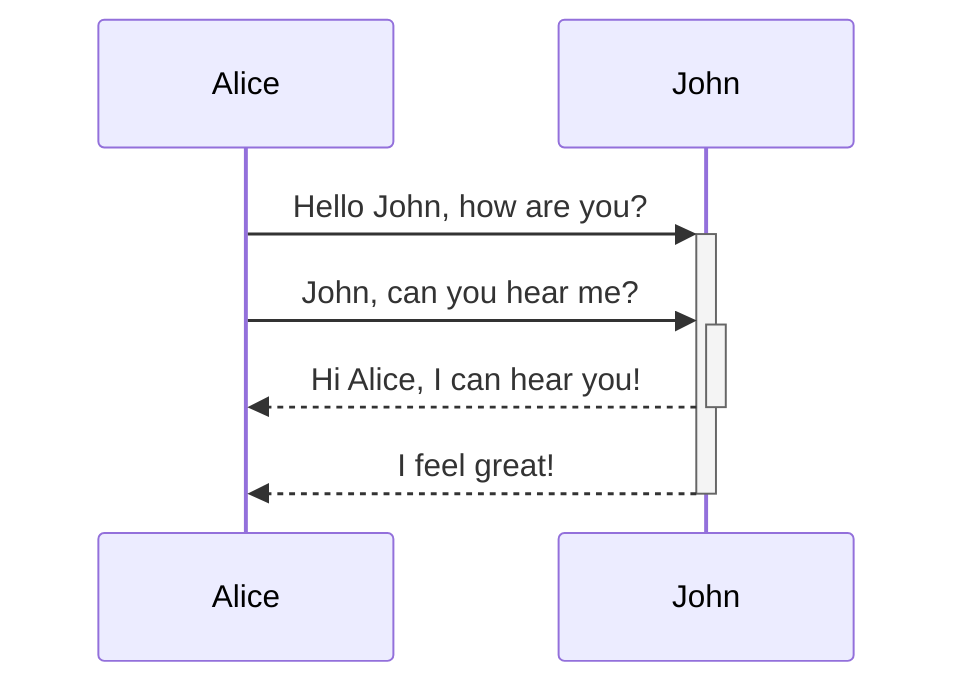
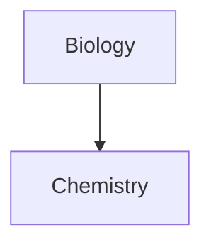

This is a simple guide to use when formatting pages in Obsidian. [^4] Most of the formatting applies the same to wiki sites.

# Basic Formatting
## Paragraphs
```
This is a paragraph.
This is not a full paragraph.

This is a spaced paragraph. Multiple        adjacent        spaces        are        removed.


as well as multiple newlines between paragraphs.

# This is a heading 1
## This is a heading 2
### This is a heading 3
#### This is a heading 4
##### This is a heading 5
###### This is a heading 6

These are Horizontal rules:
***
---
___
```
This is a paragraph.
This is not a full paragraph.

This is a spaced paragraph. Multiple        adjacent        spaces        are        removed

as well as multiple newlines between paragraphs.

==(HEADINGS HIDDEN TO NOT RUIN PAGE NAVIGATION)==
### This is a heading 3
#### This is a heading 4
##### This is a heading 5
###### This is a heading 6

These are Horizontal rules:
***
---
___

## Font
```
**Bold** or __
*Italics* or _
~~Strikethrough~~
==Highlight==
**Bold text and _nested italic_ text**
***Bold and italic text*** or ___
```
**Bold**
*Italics*
~~Strikethrough~~
==Highlight==
**Bold text and _nested italic_ text**
***Bold and italic text***

## Links and Images
```
[[Internal Link]]
[[Internal Link to a Heading#Heading 1]]
[[Internal Link|Internal Link but Renamed]]

[External Link](https://help.obsidian.md/Editing+and+formatting/Basic+formatting+syntax#Internal%20links)


![[EmbeddedImage.jpg]]
```
[[Internal Link]]
[[Internal Link|Internal Link but Renamed]] 

[External Link](https://help.obsidian.md/Editing+and+formatting/Basic+formatting+syntax#Internal%20links)

==If your URL contains blank spaces, you need to escape them by replacing them with `%20`==


![[EmbeddedImage.jpg]]

## Lists
```
- This Is a bulleted List
	- This one is indented
	This is a new line with no bullet

1. Item 1
2. Item 2

1. First list item
   1. Ordered nested list item
2. Second list item
   - Unordered nested list item

\- Line that is not a list

- [x] This is a completed task.
- [ ] This is an incomplete task.
	- [ ] Subtask
```
- This Is a bulleted List
	- This one is indented
	This is a new line with no bullet

1. Item 1
2. Item 2

1. First list item
   1. Ordered nested list item
2. Second list item
   - Unordered nested list item

\- Line that is not a list

- [x] This is a completed task.
- [ ] This is an incomplete task.
	- [ ] Subtask

## Quotes
```
> Multiline
> Quote

> [!info]
> Here's a **callout** block.

This is a %%hidden inline%% comment.

%%
This is a block comment.

Block comments can span multiple lines.
%%
```
> Multiline
> Quote

> [!info]
> Here's a **callout** block.

This is a %%hidden inline%% comment.

%%
This is a block comment.

Block comments can span multiple lines.
%%

## Code
```
Inline `code`

‎` ` ` (Remove spaces between ` ` `)
Code
Block 
‎` ` `

` ` `py
message = "This is a python script!"
if message != "Hello World"
	print(message)
` ` `
```
Inline `code`

```
Code
Block
```

```py
message = "This is a python script!"
if message != "Hello World":
	print(message)
```


## References
```
This is a simple footnote[^1].
You can also use inline footnotes. ^[This is an inline footnote.]
This is a named footnote[^note]

[^1]: This is the referenced text.
[^2]: Add 2 spaces at the start of each new line.
  This lets you write footnotes that span multiple lines.
[^note]: Named footnotes still appear as numbers, but can make it easier to identify and link references.
```
This is a simple footnote[^1].
You can also use inline footnotes. ^[This is an inline footnote.]
This is a named footnote[^note]

[^1]: This is the referenced text.
[^2]: Add 2 spaces at the start of each new line.
  This lets you write footnotes that span multiple lines.
[^note]: Named footnotes still appear as numbers, but can make it easier to identify and link references.
# Advanced Formatting
## Tables
```
This is one way to make a table:

| First name | Last name |
| ---------- | --------- |
| Max        | Planck    |
| Marie      | Curie     |

This is another way:

First name | Last name
-- | --
Max | Planck
Marie | Curie

This table has alignment:

Left-aligned text | Center-aligned text | Right-aligned text
:-- | :--: | --:
**Bold** | [[Link]] | Vert \| Bar
```
==(You can have formatting inside a table)==
[Online Table Generator](https://www.tablesgenerator.com/markdown_tables)

This is one way to make a table:

| First name | Last name |
| ---------- | --------- |
| Max        | Planck    |
| Marie      | Curie     |

This is another way:

First name | Last name
-- | --
Max | Planck
Marie | Curie

This table has alignment:

Left-aligned text | Center-aligned text | Right-aligned text
:-- | :--: | --:
**Bold** | [[Link]] | Vert \| Bar
## Diagrams
```
` ` `mermaid (Remove spaces between ` ` `)
sequenceDiagram
    Alice->>+John: Hello John, how are you?
    Alice->>+John: John, can you hear me?
    John-->>-Alice: Hi Alice, I can hear you!
    John-->>-Alice: I feel great!
` ` `

` ` `mermaid
graph TD

Biology --> Chemistry

class Biology,Chemistry internal-link;
` ` `
```
[Live Diagram Editor](https://mermaid-js.github.io/mermaid-live-editor)




## Math
LaTex is used as a plugin where `$$` can \be used for block LaTex equation and `$` can be used an singular line LaTex equation
```
$$
\begin{vmatrix}a & b\\
c & d
\end{vmatrix}=ad-bc
$$

This is an inline math expression $e^{2i\pi} = 1$.

```
[Mathjax Documentation](http://docs.mathjax.org/en/latest/basic/mathjax.html)
$$
\begin{vmatrix}a & b\\
c & d
\end{vmatrix}=ad-bc
$$

This is an inline math expression $e^{2i\pi} = 1$.

# Other Links
[Official Formatting Guide](https://help.obsidian.md/Editing+and+formatting/Basic+formatting+syntax#Internal%20links)
[Online Table Generator](https://www.tablesgenerator.com/markdown_tables)
[Live Diagram Editor](https://mermaid-js.github.io/mermaid-live-editor)
[Mathjax Documentation](http://docs.mathjax.org/en/latest/basic/mathjax.html)

[^4]: Cheat Sheet written by BubblesAndSuch - [bubs.cc]